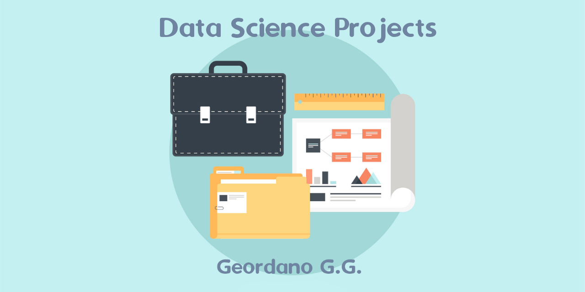

# Data Science Portfolio

>This project contains links to all my [Data Science Projects](#data-science-projects)

:dart: The main objective of this portfolio of personal data science projects is to demonstrate my skills in solving business problems through my knowledge and mastery of data science tools.



[](https://www.linkedin.com/in/geordanogg/) [](https://www.python.org/downloads/release/python-365/) [](http://perso.crans.org/besson/LICENSE.html) [](https://github.com/geordanogg/Geordano_DS_Portifolio/issues)

## Geordano Gadelha Guimarães
> <sub>*Data Scientist*</sub>

I have a Bachelor's Degree in Computer Science from UFC (Federal University of Ceara) since 2010 and from 2021 onwards I started my career migration to Data Science.

I have mastery of all stages of developing a business solution using the concepts and tools of Data Science, from understanding the business to publishing the model in production using Clouds.

I have already developed solutions for important business problems such as detecting fraud in transactions, classifying diseases early, identifying customers in churn and prioritizing customers for cross-selling.

The details of each solution are described in the projects below.


**Analytical Tools:**

- **Data Collect and Storage:** SQL, MySQL, SQLite3

- **Data Processing and Analysis:** Python

- **Development:** Git, Linux

- **Data Vizualization:** Metabase

- **Machine Learning Modeling:** Classification, Regression, Clustering

- **Machine Learning Deployment:** Heroku, AWS 


## Data Science Projects

```
- Business Problem and Context
- Machine Learning model metrics
- The performance of this model according to the company's business model.
```

> ### **Regression**

* #### Sales Prediction 
       
     - O CEO de uma rede de farmácias na Europa, a Rossman, precisa saber a previsão de vendas das suas lojas para as próximas 6 semanas. Confira [aqui]( https://github.com/geordanogg/Rossman_Sales) os detalhes deste projeto que envolve um modelo de Regressão Linear capaz de atender à demanda do CEO.
     - *The CEO of a pharmacy chain in Europe, Rossman, needs to know the sales forecast for its stores for the next 6 weeks. Check out the details of this project here, which involves a Linear Regression model capable of meeting the CEO's demand.*

> ### **Classification**

* #### Health Insurance Cross-Sell 

     - Uma empresa de seguros de saúde está interessada em oferecer um novo produto aos seus clientes, mas possui uma limitação de alcance no seu time de marketing que não sabe para quem oferecer primeiro. Confira [aqui]( https://github.com/geordanogg/Health_Insurance ) os detalhes deste projeto que, através de algoritmos de classificação, ranqueia aqueles clientes mais propensos a aceitar a oferta. 
     - *A health insurance company is interested in offering a new product to its customers, but has a limited reach in its marketing team that does not know who to offer it to first. Check out the details of this project here, which, through ranking algorithms, ranks those customers most likely to accept the offer.*

> ### **Clustering**

* #### Insiders Clustering 

     - Uma empresa de e-commerce está interessada em criar um programa de fidelidade chamado Insiders, que será formado pelos clientes mais valiosos da sua base. Confira [aqui]( https://github.com/geordanogg/Insiders_Clustering ) os detalhes deste projeto que segmenta a base de clientes usando algoritmos de clusterização e define quem serão os clientes elegíveis a participar do seleto grupo. 
     - *An e-commerce company is interested in creating a loyalty program called Insiders, which will be formed by the most valuable customers in its base. Check out the details of this project here, which segments the customer base using clustering algorithms and defines which customers will be eligible to participate in the select group.*


## **Contato:** 
[](https://www.linkedin.com/in/geordanogg)  [](mailto:geordanogg@gmail.com)
