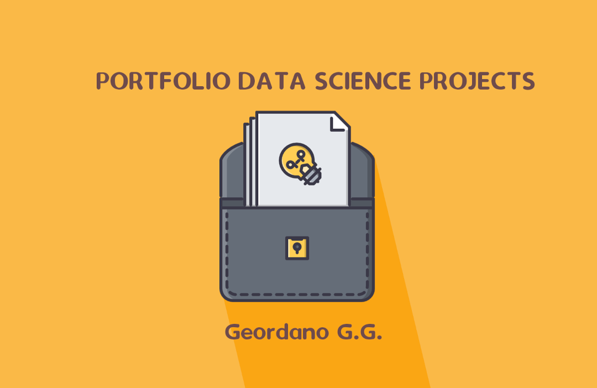

# Geordano_DS_Portifolio
This project contains links to all my Data Science Projects

The main objective of this data science personal project portfolio is to demonstrate my skills in solving business challenges through my knowledge and tools of Data Science.

- [Data Science Projects:](#Data Science Projects)

    

## Geordano Gadelha Guimaraes
*Data Scientist*

I have a Bachelor's Degree in Computer Science from UFC (Federal University of Ceara) since 2010 and from 2021 onwards I started my career migration to Data Science.

I have mastery of all stages of developing a business solution using the concepts and tools of Data Science, from understanding the business to publishing the model in production using Clouds.

I have already developed solutions for important business problems such as detecting fraud in transactions, classifying diseases early, identifying customers in churn and prioritizing customers for cross-selling.

The details of each solution are described in the projects below.

**Analytical Tools:**

**Data Collect and Storage:** SQL, MySQL, SQLite3

**Data Processing and Analysis:** Python, *Spark*, *Airflow*

**Development:** Git, Linux

**Data Vizualization:** *Power BI

**Machine Learning Modeling:** Classification, Regression, Clustering, Time Series

**Machine Learning Deployment:** Heroku *AWS Cloud* and *Google Cloud Platform ( GCP )*  

**Links:**
* 
* 

## Data Science Projects:

### [Sales Prediction]( https://gitlab.com/geordanogg/rossmann_sales_predictions )

### [Cardiovascular Disease Detection]( https://gitlab.com/geordanogg/ )

Building a Machine Learning Model to detect cardiovascular disease in early stages leverage the diagnostic precision made by health professionals.  
In this project, I developed a Machine Learning model able to detect disease in early stages with **65% accuracy** over 70k patience.
The performance of this model would increase **revenue of U$81.2 millions** according to the company's business model described in the problem definition.

### [Fraud Detection]( https://gitlab.com/geordanogg/ ) 

Machine Learning and taking fraud detection to the next level. Companies are reducing their costs with detecting fraudulent transactions, while companies providing theses types of services are increasing thier income.
In this project, I built a Machine Learning classifier to label fraudulent transactions with **99.63% of accuracy.**
The performance of this model would bring **revenue of U$877,5 millions** according to the company's business model described in the problem definition.

### [Churn Prediciton]( https://gitlab.com/geordanogg/ ) 

In saturated markets, the cost to retain a customer is much less than prospecting for new customers. Machine Learning models are able to predict whether or not the customer will renew their service contract with the company in the next year. This information about the users is very important to optimize efforts in prioritizing customers who should continue with the contract in the company.
In this context, I developed a Machine Learning algorithm to identify whether or not a customer will stop using the banking service. The performance of the model in identifying the customer who will enter in churn period is **90%**, which represents an additional **U$ 20 million in revenue**, as described in the problem below.

### [Health Insurance Cross-Sell]( https://gitlab.com/geordanogg/ ) 
